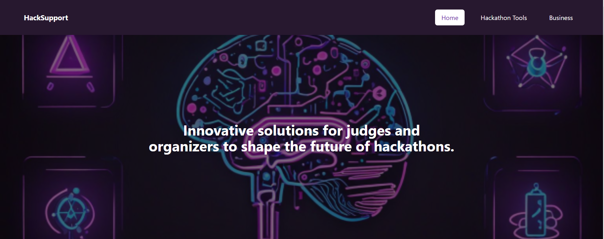
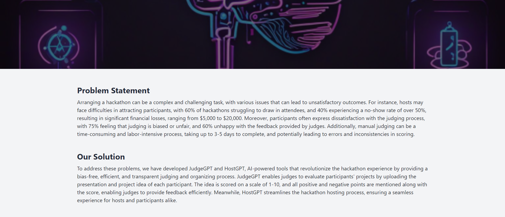

# HackSupport Team

[![Contributors][contributors-shield]][contributors-url]
[![Forks][forks-shield]][forks-url]
[![Stargazers][stars-shield]][stars-url]
[![Issues][issues-shield]][issues-url]
<table>
    <tbody>
        <tr>
          <td align="center">
                <a href="https://www.linkedin.com/in/moligott/">
                    
                    <br />
                    <sub><b>Moli G.ott.</b></sub>
                </a> 
            </td>
          <td align="center">
                <a href="#">
                    
                    <br />
                    <sub><b>Tobias Sami</b></sub>
                </a> 
            </td>
            <td align="center">
                <a href="https://github.com/abutair">
                    
                    <br />
                    <sub><b>Mohammad Abutair</b></sub>
                </a> 
            </td>
                        <td align="center">
                <a href="https://www.linkedin.com/in/aleezarubab/">
                    
                    <br />
                    <sub><b>Aleeza Rubab</b></sub>
                </a> 
            </td>
          <td align="center">
                <a href="#">
                    
                    <br />
                    <sub><b>Khadijah Shabir</b></sub>
                </a> 
            </td>
            <td align="center">
                <a href="#">
                    
                    <br />
                    <sub><b>Saima Zainab</b></sub>
                </a> 
            </td>

     
</tbody>
<table>

# Project Description:

Welcome to the HackSupport - An innovative solution for judges and organizers to shape the future of hackathons.  we have developed JudgeGPT and HostGPT, AI-powered tools that revolutionize the hackathon experience by providing a bias-free, efficient, and transparent judging and organizing process. JudgeGPT enables judges to evaluate participants' projects by uploading the presentation and project idea of each participant. The idea is scored on a scale of 1-10, and all positive and negative points are mentioned along with the score, enabling judges to provide feedback efficiently. Meanwhile, HostGPT streamlines the hackathon hosting process, ensuring a seamless experience for hosts and participants alike.





<p>
 <p>
    <a href="https://github.com/Ahmadjajja/EcoFactory"><strong>Explore the docs »</strong></a>
    <br />
    <br />
    <a href="https://lablab.ai/event/leap-2024-hackathon/ecofactor-team/ecofactor-smart-manufactures-solutions">View Project</a>
    ·
    <a href="https://github.com/Ahmadjajja/EcoFactory/issues">Report Bug</a>
    ·
    <a href="https://github.com/Ahmadjajja/EcoFactory/issues">Request Feature</a>
  </p>
</p>

![Python Version][python-image]
![License][license-image]


## Installation 

To install and run HacksSupport locally, follow these steps:

1. **Clone the Repository:**

    ```bash
    git clone https://github.com/aleeza23/HacksSupport

    ```
2. **Create Virtual Environment and Activate it**

    ```bash
        python -m venv env #create virtual environment
        ./env/Scripts/Activate.ps1 #activate the virtual environment
    ```
3. **Install the packages:**

    ```bash
        cd server 
        pip install -r requirements.txt
    
    ```

4. **Run the Application** For back-end 

    ```bash
        python app.py    
    ```   
5. **For Front-end**
    ```bash
        cd client
    ```
6. **install packages**
    ```bash

   npm i
    ```
7. **start the client**
    ```bash

   npm run dev

    ```

### Where to ask for help?
Report the bug [here](https://github.com/aleeza23/HacksSupport/issues)


## Contributing

Pull requests are welcome. For major changes, please open an issue first to discuss what you would like to change.

To contribute to the HacksSupport, 

Clone this repo locally and commit your code on a separate branch.
If you're making core changes please write unit tests for your code, and check that everything works by running the following before opening a pull-request

or 

1. Fork the Project
2. Create your Feature Branch (`git checkout -b yourBranchName`)
3. Make changes and make sure everything is working fine
4. Commit your Changes (`git commit -m 'Add message here'`)
5. Push to the Branch (`git push origin yourBranchName`)
6. Open a Pull Request

## License

Distributed under the MIT License. See `LICENSE` for more information.

[python-image]: https://img.shields.io/badge/python-v3.6+-blue.svg
[license-image]: https://img.shields.io/badge/license-MIT-blue.svg

[contributors-shield]: https://img.shields.io/github/contributors/aleeza23/HacksSupport.svg?style=for-the-badge
[contributors-url]: https://github.com/aleeza23/HacksSupport/graphs/contributors
[forks-shield]: https://img.shields.io/github/forks/aleeza23/HacksSupport.svg?style=for-the-badge
[forks-url]: https://github.com/aleeza23/HacksSupport/network/members
[stars-shield]: https://img.shields.io/github/stars/aleeza23/HacksSupport.svg?style=for-the-badge
[stars-url]: https://github.com/aleeza23/HacksSupport/stargazers
[issues-shield]: https://img.shields.io/github/issues/aleeza23/HacksSupport.svg?style=for-the-badge
[issues-url]: https://github.com/aleeza23/HacksSupport/issues
[license-shield]: https://img.shields.io/github/license/aleeza23/HacksSupport.svg?style=for-the-badge
[license-url]: https://github.com/aleeza23/HacksSupport/blob/master/LICENSE.txt
[linkedin-shield]: https://img.shields.io/badge/-LinkedIn-black.svg?style=for-the-badge&logo=linkedin&colorB=555


